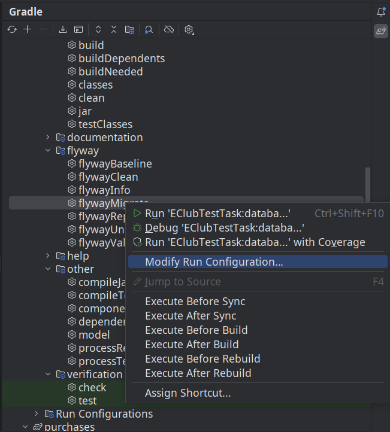

### Common database

Database migrations are defined here.
PostgreSQL is used as a database, although none of its specific features are used.

Note that in latest versions of PostgreSQL permission to use schema like in [script](prepoare_postgres_for_flyway.sql).

To use other database either 
- add additional migration and its dependencies (jdbc driver and the flyway dependency)
or 
- just apply the scripts in `src/main/resources` to the database manually.

Before launching the migration be sure to

To launch manually:

```shell
export DB_URL='<database_url>'                # e. g. jdbc:postgresql://localhost:5432/eclub
export DB_USER='<database_user>'              # e. g. eclub
export DB_PASSWORD='<database_password>'      # e. g. eclub's password

gradlew :database:flywayMigrate
```

Alternatively, if you use IntelliJ Idea, configure:


